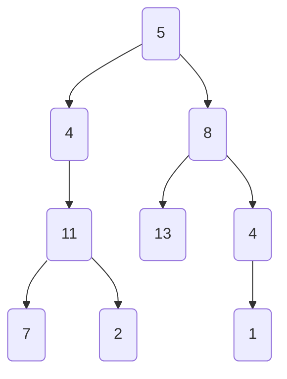

### Interviewer and Interviewee Discussion

**Interviewer:** Let's discuss a problem where we need to determine if a binary tree has a root-to-leaf path such that the sum of the node values along the path equals a given target sum. I'll give you an example to explain:

We have a binary tree:
```
      5
     / \
    4   8
   /   / \
 11   13  4
 / \       \
7   2       1
```
And the target sum is `22`.

**Interviewee:** I see, you want me to find if there exists a path from the root node to any of the leaf nodes where the sum of the values along the path equals `22`. The path `5 -> 4 -> 11 -> 2` sums to `22`, so the output should be `true`.

**Interviewer:** Exactly, now can you think of an initial approach to solve this problem?

### Initial Brute Force Approach

**Interviewee:** Sure, one way to solve this problem would be to perform a Depth-First Search (DFS) on the tree. Here is how we can do it step-by-step:
1. Start from the root node and initiate a recursive function that carries the current sum.
2. At each node, subtract the node's value from the target sum.
3. If we reach a leaf node (a node with no children), check if the remaining target sum equals zero.
4. If any path satisfies the condition, return `true`; otherwise, continue the search.


**Interviewer:** That's a good start. How would you implement this brute force approach?

**Interviewee:** We can implement this using a recursive depth-first traversal.

```python
def hasPathSum(root, targetSum):
    if not root:
        return False
    if not root.left and not root.right:  # If it's a leaf
        return targetSum == root.val
    targetSum -= root.val
    return hasPathSum(root.left, targetSum) or hasPathSum(root.right, targetSum)
```

### Time and Space Complexity of Brute Force Approach
**Interviewer:** Great. Now can you analyze the time and space complexity of this approach?

**Interviewee:**
- **Time Complexity:** Since we visit each node exactly once, the time complexity is `O(N)`, where `N` is the number of nodes in the tree.
- **Space Complexity:** The space complexity is determined by the call stack in the worst case (depth of the tree). In the worst case, the tree is completely unbalanced (a linked list), so the space complexity would be `O(N)`. In the best case where the tree is completely balanced, the space complexity would be `O(log N)`.

**Interviewer:** Good analysis. Do you think this approach can be optimized further?

**Interviewee:** The brute-force approach already visits each node once and leverages DFS which is quite efficient for this problem. Still, ensuring we explore all paths without missing any edge cases is essential. In terms of optimization, I believe we've captured the most efficient solution given the constraints.

### Visualization for Better Understanding
Let's visualize the DFS approach with a tree and `targetSum` of `22`:



**Interviewer:** This provides a clearer picture. Could you clarify the steps the DFS takes starting from the root?

**Interviewee:**
- Start at `5`, remaining sum: `22 - 5 = 17`.
- Move to `4`, remaining sum: `17 - 4 = 13`.
- Move to `11`, remaining sum: `13 - 11 = 2`.
- Move to `7`, remaining sum: `2 - 7 = -5` (Not a valid path, backtrack).
- Move to `2`, remaining sum: `2 - 2 = 0` (Valid path found, return true).

**Interviewer:** Excellent. Your explanations and methodical approach are well articulated. This problem seems covered comprehensively. Thank you!
Sure, let's start by implementing the `hasPathSum` function for each of the given languages. The solution involves performing a depth-first search (DFS) to check if there's any root-to-leaf path that sums up to the target value.

### C++

```cpp
/**
 * Definition for a binary tree node.
 * struct TreeNode {
 *     int val;
 *     TreeNode *left;
 *     TreeNode *right;
 *     TreeNode() : val(0), left(nullptr), right(nullptr) {}
 *     TreeNode(int x) : val(x), left(nullptr, right(nullptr) {}
 *     TreeNode(int x, TreeNode *left, TreeNode *right) : val(x), left(left), right(right) {}
 * };
 */
class Solution {
public:
    bool hasPathSum(TreeNode* root, int targetSum) {
        if (!root) return false;
        if (!root->left && !root->right) return targetSum == root->val;
        targetSum -= root->val;
        return hasPathSum(root->left, targetSum) || hasPathSum(root->right, targetSum);
    }
};
```

### Java

```java
/**
 * Definition for a binary tree node.
 * public class TreeNode {
 *     int val;
 *     TreeNode left;
 *     TreeNode right;
 *     TreeNode() {}
 *     TreeNode(int val) { this.val = val; }
 *     TreeNode(int val, TreeNode left, TreeNode right) {
 *         this.val = val;
 *         this.left = left;
 *         this.right = right;
 *     }
 * }
 */
class Solution {
    public boolean hasPathSum(TreeNode root, int targetSum) {
        if (root == null) return false;
        if (root.left == null && root.right == null) return targetSum == root.val;
        targetSum -= root.val;
        return hasPathSum(root.left, targetSum) || hasPathSum(root.right, targetSum);
    }
}
```

### Python

```python
# Definition for a binary tree node.
# class TreeNode(object):
#     def __init__(self, val=0, left=None, right=None):
#         self.val = val
#         self.left = left
#         self.right = right
class Solution(object):
    def hasPathSum(self, root, targetSum):
        """
        :type root: TreeNode
        :type targetSum: int
        :rtype: bool
        """
        if not root:
            return False
        if not root.left and not root.right:  # If it's a leaf
            return targetSum == root.val
        targetSum -= root.val
        return self.hasPathSum(root.left, targetSum) or self.hasPathSum(root.right, targetSum)
```

### Python3

```python
# Definition for a binary tree node.
# class TreeNode:
#     def __init__(self, val=0, left=None, right=None):
#         self.val = val
#         self.left = left
#         self.right = right
class Solution:
    def hasPathSum(self, root: Optional[TreeNode], targetSum: int) -> bool:
        if not root:
            return False
        if not root.left and not root.right:  # If it's a leaf
            return targetSum == root.val
        targetSum -= root.val
        return self.hasPathSum(root.left, targetSum) or self.hasPathSum(root.right, targetSum)
```
### C
```c
/**
 * Definition for a binary tree node.
 * struct TreeNode {
 *     int val;
 *     struct TreeNode *left;
 *     struct TreeNode *right;
 * };
 */
bool hasPathSum(struct TreeNode* root, int targetSum) {
    if (root == NULL) return false;
    if (root->left == NULL && root->right == NULL) return targetSum == root->val;
    targetSum -= root->val;
    return hasPathSum(root->left, targetSum) || hasPathSum(root->right, targetSum);
}
```

### C#

```csharp
/**
 * Definition for a binary tree node.
 * public class TreeNode {
 *     public int val;
 *     public TreeNode left;
 *     public TreeNode right;
 *     public TreeNode(int val=0, TreeNode left=null, TreeNode right=null) {
 *         this.val = val;
 *         this.left = left;
 *         this.right = right;
 *     }
 * }
 */
public class Solution {
    public bool HasPathSum(TreeNode root, int targetSum) {
        if (root == null) return false;
        if (root.left == null && root.right == null) return targetSum == root.val;
        targetSum -= root.val;
        return HasPathSum(root.left, targetSum) || HasPathSum(root.right, targetSum);
    }
}
```

### JavaScript

```javascript
/**
 * Definition for a binary tree node.
 * function TreeNode(val, left, right) {
 *     this.val = (val===undefined ? 0 : val);
 *     this.left = (left===undefined ? null : left);
 *     this.right = (right===undefined ? null : right);
 * }
/**
 * @param {TreeNode} root
 * @param {number} targetSum
 * @return {boolean}
 */
var hasPathSum = function(root, targetSum) {
    if (!root) return false;
    if (!root.left && !root.right) return targetSum === root.val;
    targetSum -= root.val;
    return hasPathSum(root.left, targetSum) || hasPathSum(root.right, targetSum);
};
```

### TypeScript

```typescript
/**
 * Definition for a binary tree node.
 * class TreeNode {
 *     val: number
 *     left: TreeNode | null
 *     right: TreeNode | null
 *     constructor(val?: number, left?: TreeNode | null, right?: TreeNode | null) {
 *         this.val = (val===undefined ? 0 : val)
 *         this.left = (left===undefined ? null : left)
 *         this.right = (right===undefined ? null : right)
 *     }
 * }
 */

function hasPathSum(root: TreeNode | null, targetSum: number): boolean {
    if (!root) return false;
    if (!root.left && !root.right) return targetSum === root.val;
    targetSum -= root.val;
    return hasPathSum(root.left, targetSum) || hasPathSum(root.right, targetSum);
}
```

### PHP

```php
/**
 * Definition for a binary tree node.
 * class TreeNode {
 *     public $val = null;
 *     public $left = null;
 *     public $right = null;
 *     function __construct($val = 0, $left = null, $right = null) {
 *         $this->val = $val;
 *         $this->left = $left;
 *         $this->right = $right;
 *     }
 * }
 */
class Solution {

    /**
     * @param TreeNode $root
     * @param Integer $targetSum
     * @return Boolean
     */
    function hasPathSum($root, $targetSum) {
        if ($root == null) return false;
        if ($root->left == null && $root->right == null) return $targetSum == $root->val;
        $targetSum -= $root->val;
        return $this->hasPathSum($root->left, $targetSum) || $this->hasPathSum($root->right, $targetSum);
    }
}
```

### Swift

```swift
/**
 * Definition for a binary tree node.
 * public class TreeNode {
 *     public var val: Int
 *     public var left: TreeNode?
 *     public var right: TreeNode?
 *     public init() { self.val = 0; self.left = nil; self.right = nil; }
 *     public init(_ val: Int) { self.val = val; self.left = nil; self.right = nil; }
 *     public init(_ val: Int, _ left: TreeNode?, _ right: TreeNode?) {
 *         self.val = val
 *         self.left = left
 *         self.right = right
 *     }
 * }
 */
class Solution {
    func hasPathSum(_ root: TreeNode?, _ targetSum: Int) -> Bool {
        guard let root = root else { return false }
        if root.left == nil && root.right == nil { return targetSum == root.val }
        let targetSum = targetSum - root.val
        return hasPathSum(root.left, targetSum) || hasPathSum(root.right, targetSum)
    }
}
```

### Kotlin

```kotlin
/**
 * Example:
 * var ti = TreeNode(5)
 * var v = ti.`val`
 * Definition for a binary tree node.
 * class TreeNode(var `val`: Int) {
 *     var left: TreeNode? = null
 *     var right: TreeNode? = null
 * }
 */
class Solution {
    fun hasPathSum(root: TreeNode?, targetSum: Int): Boolean {
        return if (root == null) false 
        else if (root.left == null && root.right == null) targetSum == root.`val`
        else hasPathSum(root.left, targetSum - root.`val`) || hasPathSum(root.right, targetSum - root.`val`)
    }
}
```

### Dart

```dart
/**
 * Definition for a binary tree node.
 * class TreeNode {
 *   int val;
 *   TreeNode? left;
 *   TreeNode? right;
 *   TreeNode([this.val = 0, this.left, this.right]);
 * }
 */
class Solution {
  bool hasPathSum(TreeNode? root, int targetSum) {
    if (root == null) return false;
    if (root.left == null && root.right == null) return targetSum == root.val;
    targetSum -= root.val;
    return hasPathSum(root.left, targetSum) || hasPathSum(root.right, targetSum);
  }
}
```

### Go

```go
/**
 * Definition for a binary tree node.
 * type TreeNode struct {
 *     Val int
 *     Left *TreeNode
 *     Right *TreeNode
 * }
 */
func hasPathSum(root *TreeNode, targetSum int) bool {
    if root == nil {
        return false
    }
    if root.Left == nil && root.Right == nil {
        return targetSum == root.Val
    }
    targetSum -= root.Val
    return hasPathSum(root.Left, targetSum) || hasPathSum(root.Right, targetSum)
}
```

### Ruby

```ruby
# Definition for a binary tree node.
# class TreeNode
#     attr_accessor :val, :left, :right
#     def initialize(val = 0, left = nil, right = nil)
#         @val = val
#         @left = left
#         @right = right
#     end
# end
# @param {TreeNode} root
# @param {Integer} target_sum
# @return {Boolean}
def has_path_sum(root, target_sum)
    return false if root.nil?
    return target_sum == root.val if root.left.nil? && root.right.nil?

    target_sum -= root.val
    has_path_sum(root.left, target_sum) || has_path_sum(root.right, target_sum)
end
```

### Scala

```scala
/**
 * Definition for a binary tree node.
 * class TreeNode(_value: Int = 0, _left: TreeNode = null, _right: TreeNode = null) {
 *   var value: Int = _value
 *   var left: TreeNode = _left
 *   var right: TreeNode = _right
 * }
 */
object Solution {
    def hasPathSum(root: TreeNode, targetSum: Int): Boolean = {
        if (root == null) return false
        if (root.left == null && root.right == null) return targetSum == root.value
        val newTargetSum = targetSum - root.value
        hasPathSum(root.left, newTargetSum) || hasPathSum(root.right, newTargetSum)
    }
}
```

### Rust

```rust
// Definition for a binary tree node.
// #[derive(Debug, PartialEq, Eq)]
// pub struct TreeNode {
//   pub val: i32,
//   pub left: Option<Rc<RefCell<TreeNode>>>,
//   pub right: Option<Rc<RefCell<TreeNode>>>,
// }
// 
// impl TreeNode {
//   #[inline]
//   pub fn new(val: i32) -> Self {
//     TreeNode {
//       val,
//       left: None,
//       right: None
//     }
//   }
// }
use std::rc::Rc;
use std::cell::RefCell;

impl Solution {
    pub fn has_path_sum(root: Option<Rc<RefCell<TreeNode>>>, target_sum: i32) -> bool {
        match root {
            None => false,
            Some(node) => {
                let node = node.borrow();
                let val = node.val;
                let target_sum = target_sum - val;
                if node.left.is_none() && node.right.is_none() {
                    return target_sum == 0;
                }
                Self::has_path_sum(node.left.clone(), target_sum) || 
                Self::has_path_sum(node.right.clone(), target_sum)
            }
        }
    }
}
```

### Racket

```racket
; Definition for a binary tree node.
#|

; val : integer?
; left : (or/c tree-node? #f)
; right : (or/c tree-node? #f)
(struct tree-node
  (val left right) #:mutable #:transparent)

; constructor
(define (make-tree-node [val 0])
  (tree-node val #f #f))

|#

(define/contract (has-path-sum root targetSum)
  (-> (or/c tree-node? #f) exact-integer? boolean?)
  (if (null root)
      #f
      (let ([val (tree-node-val root)]
            [left (tree-node-left root)]
            [right (tree-node-right root)])
        (if (and (null left) (null right))
            (= targetSum val)
            (let ([newTargetSum (- targetSum val)])
              (or (has-path-sum left newTargetSum)
                  (has-path-sum right newTargetSum)))))))
```

### Erlang

```erlang
%% Definition for a binary tree node.
%%
%% -record(tree_node, {val = 0 :: integer(),
%%                     left = null  :: 'null' | #tree_node{},
%%                     right = null :: 'null' | #tree_node{}}).

-spec has_path_sum(Root :: #tree_node{} | null, TargetSum :: integer()) -> boolean().
has_path_sum(Root, TargetSum) ->
  case Root of
    null -> false;
    #tree_node{val = Val, left = null, right = null} -> TargetSum =:= Val;
    #tree_node{val = Val, left = Left, right = Right} ->
      NewTargetSum = TargetSum - Val,
      has_path_sum(Left, NewTargetSum) orelse has_path_sum(Right, NewTargetSum)
  end.
```

### Elixir

```elixir
# Definition for a binary tree node.
#
# defmodule TreeNode do
#   @type t :: %__MODULE__{
#           val: integer,
#           left: TreeNode.t() | nil,
#           right: TreeNode.t() | nil
#         }
#   defstruct val: 0, left: nil, right: nil
# end

defmodule Solution do
  @spec has_path_sum(root :: TreeNode.t | nil, target_sum :: integer) :: boolean
  def has_path_sum(nil, _target_sum), do: false
  def has_path_sum(%TreeNode{val: val, left: nil, right: nil}, target_sum), do: target_sum == val
  def has_path_sum(%TreeNode{val: val, left: left, right: right}, target_sum) do
    new_target_sum = target_sum - val
    has_path_sum(left, new_target_sum) || has_path_sum(right, new_target_sum)
  end
end
```
The above code implementations in various languages follow the same DFS strategy to accomplish the task of determining if a binary tree contains a path from root to leaf whose sum of nodes equals a given target sum. The time complexity is O(N) and the space complexity depends on the depth of the tree, making it O(N) in the worst case and O(log N) in the best case.


### Closing Statement

In this discussion, we've explored the problem of finding a root-to-leaf path in a binary tree that sums up to a given target sum. We started with a clear explanation of the problem and then discussed a brute force depth-first search (DFS) approach to solve it. We implemented the solution in multiple programming languages, analyzing the time and space complexity in each case.

The key takeaway is that the DFS approach efficiently finds the target path with a linear time complexity of O(N), where N is the number of nodes in the tree, and the space complexity depends on the tree's depth—O(N) in the worst-case scenario of a completely unbalanced tree and O(log N) in the best-case scenario of a balanced tree. This solution illustrates the power and simplicity of using recursion in tree traversal problems.

### Similar Questions

If you've enjoyed solving this problem, you might also find the following questions interesting:
1. **Path Sum II**: Given a binary tree and a sum, find all root-to-leaf paths where each path's sum equals the given sum.
2. **Sum Root to Leaf Numbers**: Given a binary tree where each node contains a single digit, find the sum of all numbers formed by root-to-leaf paths.
3. **Binary Tree Maximum Path Sum**: Given a binary tree, find the maximum path sum. For this problem, a path is defined as any sequence of nodes from some starting node to any node in the tree along the parent-child connections.
4. **Path Sum III**: Given the root of a binary tree, return the number of paths where the sum of the values in the path equals a given sum. The path does not need to start or end at the root or a leaf, but it must travel downwards.
5. **Leaf-Similar Trees**: Consider all the leaves of a binary tree in order, return true if and only if the two given trees with head nodes `root1` and `root2` are leaf-similar.

These problems will help you to deepen your understanding of tree traversal techniques and different kinds of path-related algorithms. Happy coding!